# Finance and Daily Collection Management

## Project Case Study

A full-stack application for managing customers, loans, and daily collections, with a React web interface and a Flutter mobile app for field agents.

## Business Problem

Daily collection operations need consistent records of loans, payments, outstanding balances, and agent activity. Field agents also need to record collections when internet access is unavailable.

## Core Features

- Customer management
- Loan creation and lifecycle tracking
- Daily collection recording and outstanding balance tracking
- Role-based access and permission checks
- Dashboards, analytics, and reports
- CSV, Excel, and PDF exports
- Offline mobile collections with later synchronization

## Application Screenshots

### Web Application

#### Dashboard
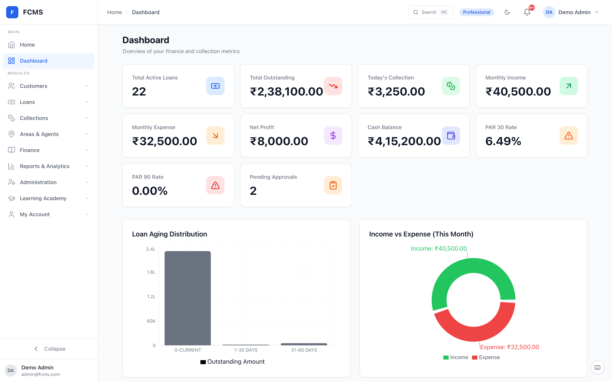

#### Customer Management
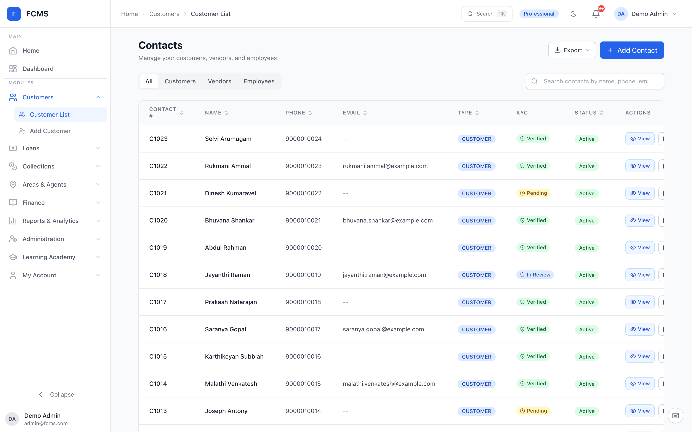

#### Loan Management
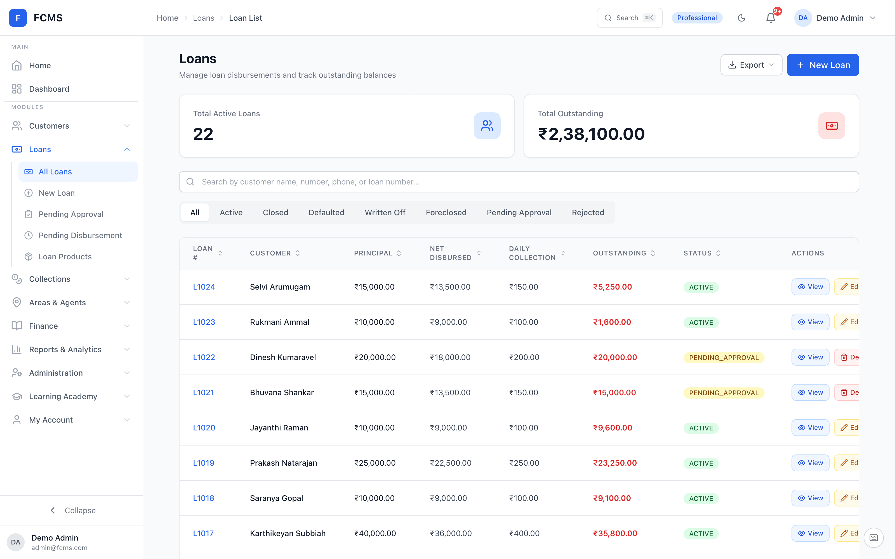

#### Loan Details
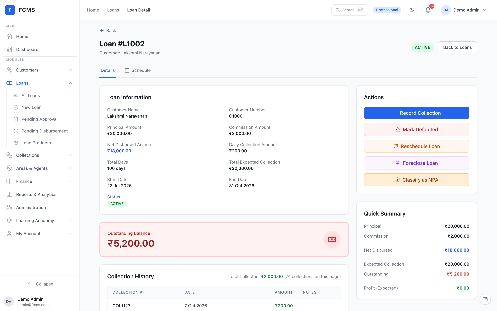

#### Collection Entry
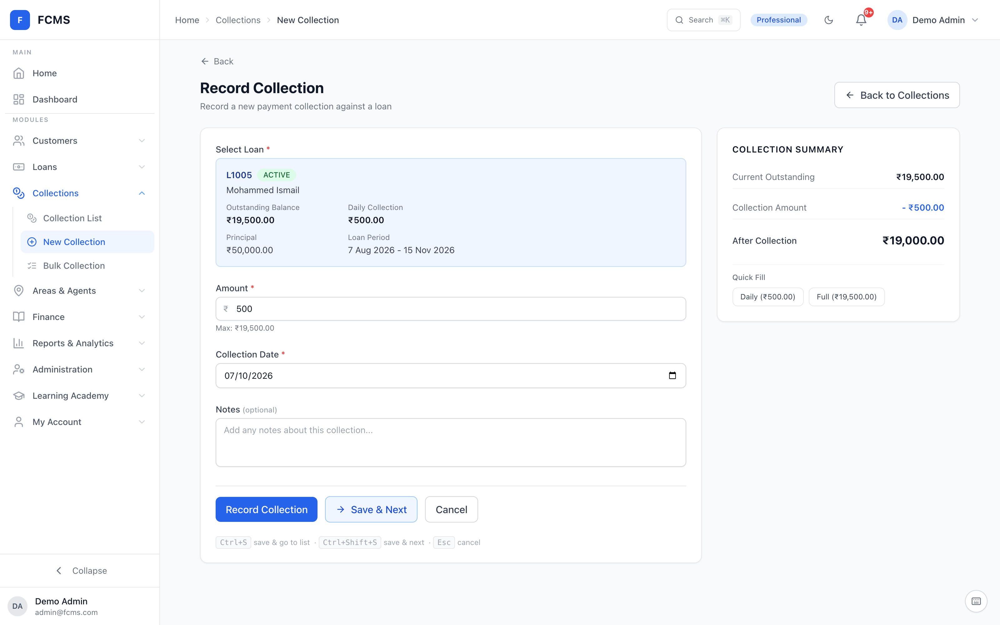

#### Bulk Collection
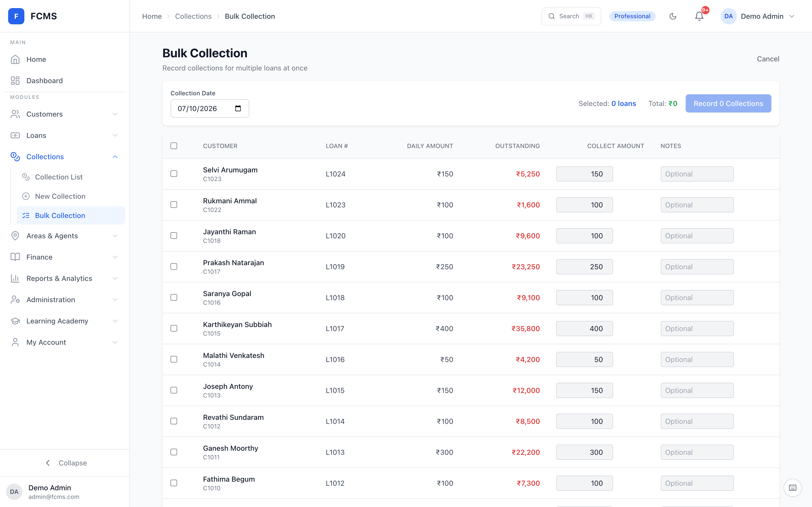

### Mobile Application

#### Login and Home

  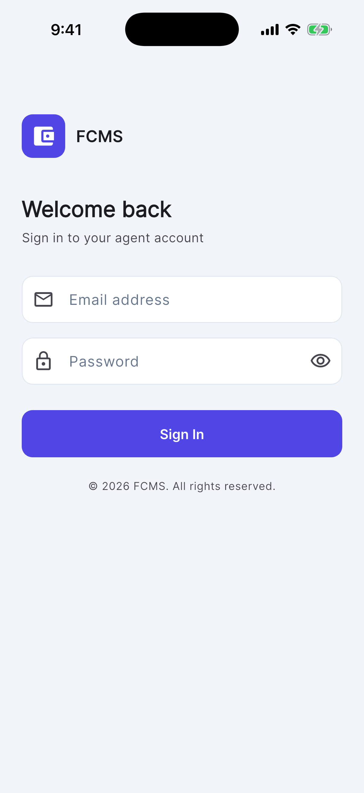
  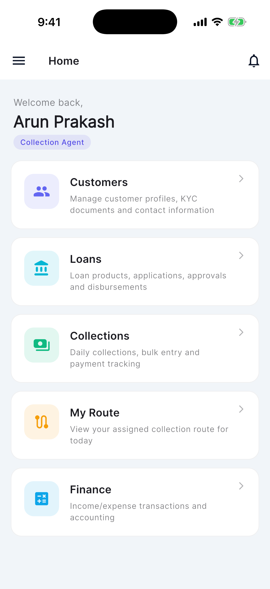

#### Collection Routes

  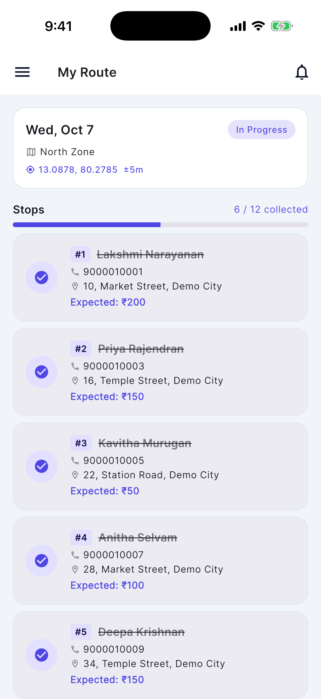
  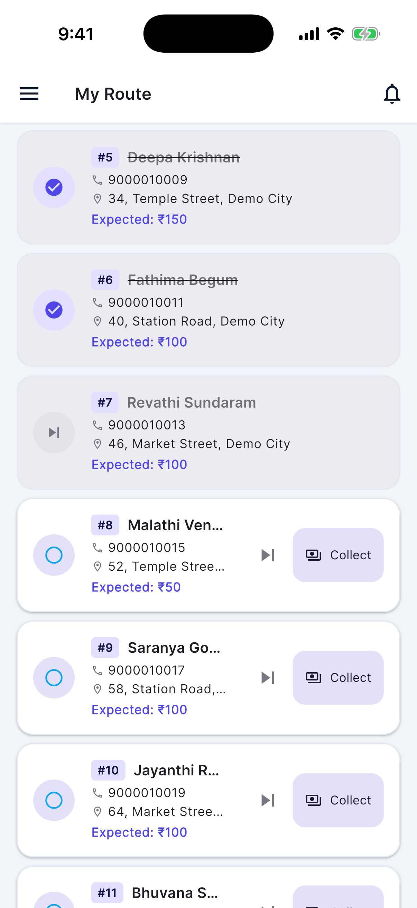

#### Daily Collections and Payment Entry

  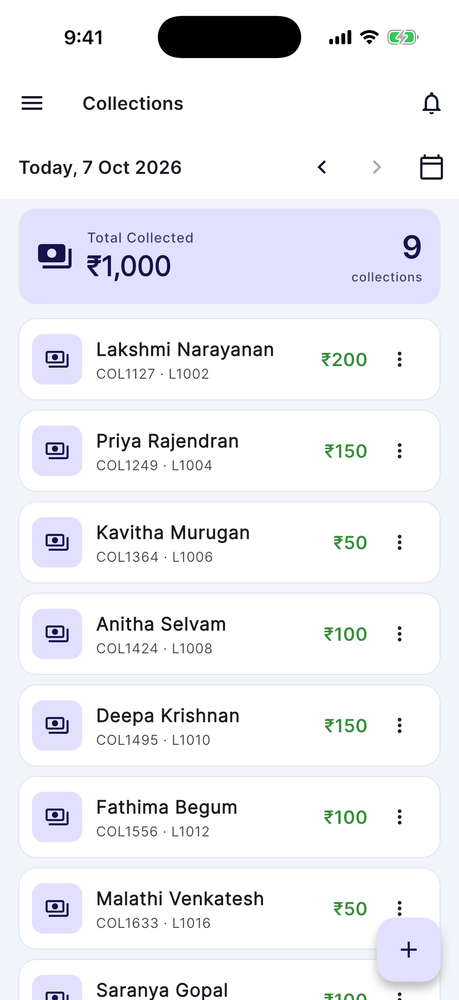
  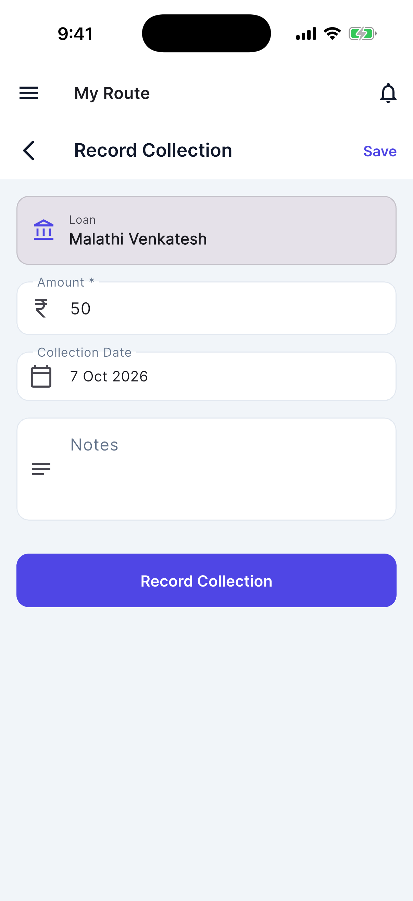

## Technology Stack

| Area | Technologies |
|---|---|
| Backend | Java 17, Spring Boot, Spring Security |
| Authentication | JWT, refresh tokens, BCrypt |
| Database | PostgreSQL |
| Persistence | Spring Data JPA, Hibernate |
| Database migrations | Flyway |
| Web frontend | React, TypeScript, Vite, Tailwind CSS |
| State and API calls | React Context, Axios |
| Forms and charts | React Hook Form, Recharts |
| Mobile | Flutter, Dart, Riverpod, Dio, SQLite |
| Backend testing | JUnit 5, Mockito, AssertJ |
| Build and deployment | Maven, shell and Windows batch scripts |

## Architecture
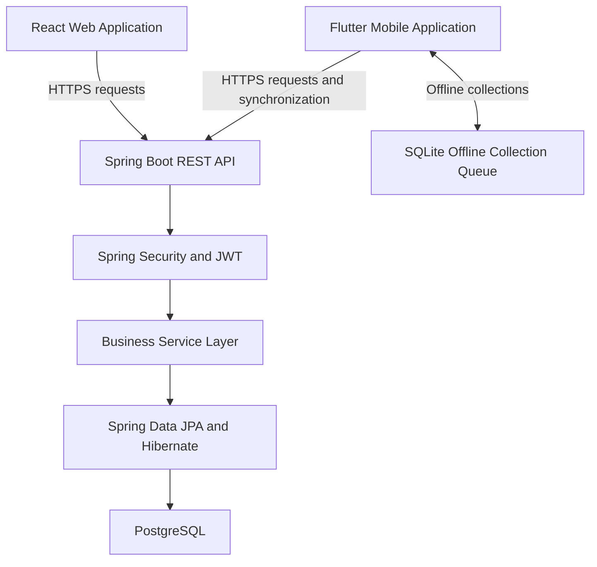

The React web application and Flutter mobile application share a Spring Boot backend. Spring Security handles authentication and authorization, while the service layer manages business rules and transactions.

PostgreSQL stores application data through Spring Data JPA and Hibernate. The mobile app queues collections locally in SQLite when offline and synchronizes them when connectivity returns.

## Business Rules

- A customer can have only one active loan at a time.
- A new loan can be created after the existing loan is completed.
- Loan records track the principal, agent commission, net disbursed amount, daily collection amount, and repayment period.
- Collections cannot exceed the remaining outstanding balance.
- Collection validation prevents duplicate payment records.
- Each collection records its date, amount, collecting agent, and remarks.
- Access to operations is controlled through roles and permissions.

## Engineering Highlights

- JWT authentication with refresh-token handling
- Server-side role and permission checks
- Request rate limiting
- Versioned database migrations
- DTO mapping with MapStruct
- Service-layer transaction management
- Offline collection queue and synchronization
- Automated collection-service tests

## Testing and Validation

The backend includes collection-service unit tests using JUnit 5, Mockito, and AssertJ, with mocked repositories.

Current automated backend coverage focuses on the collection service. Broader integration and end-to-end testing remain areas for improvement.

### Current Coverage Limits

- Backend automated tests focus on the collection service.
- Broader integration and end-to-end testing remain areas for improvement.

## My Contribution

Handled requirements, application design, backend and frontend development, mobile functionality, testing, deployment, and server maintenance.

## About This Repository

This repository presents the project's business context, architecture, and engineering approach as a portfolio case study.
