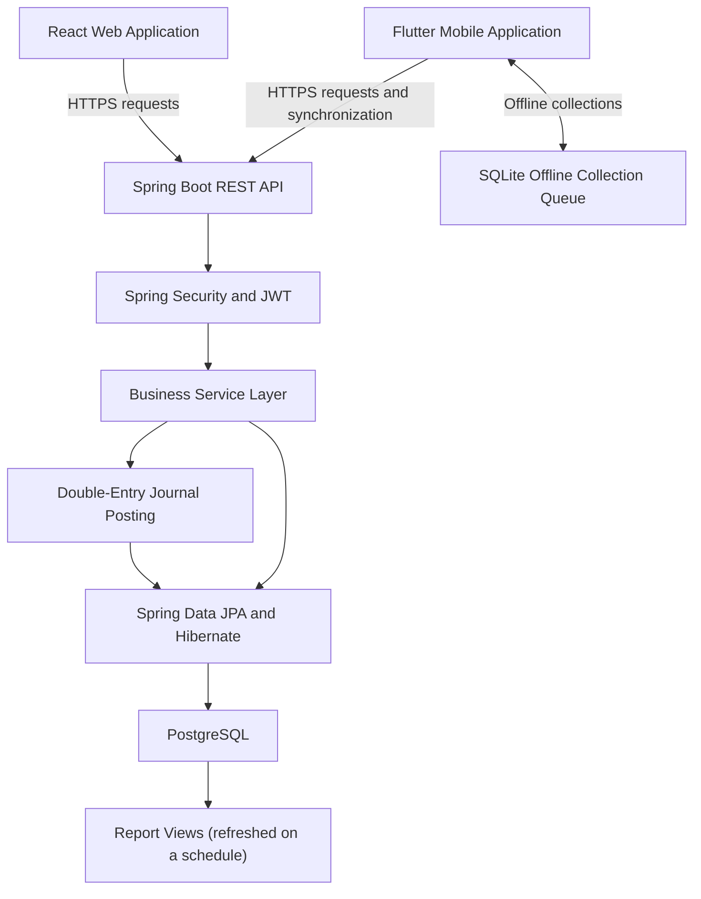

# Finance and Daily Collection Management

## Project Case Study

A full-stack platform for lenders who give short-term loans repaid in daily instalments collected in person. Office staff manage customers, loans and accounts in a React web application; field agents follow a daily route and record payments in a Flutter mobile app that keeps working without internet. Every disbursement and collection is posted to the books automatically, so the accounts stay balanced without manual bookkeeping. One installation serves several lending businesses, each with its own isolated data.

## Business Problem

Daily collection operations need consistent records of loans, payments, outstanding balances and agent activity, and the accounts have to match what was collected in the field. Field agents also need to record collections when internet access is unavailable, and managers need up-to-date figures on collections, overdue loans and portfolio risk.

## Core Features

**Customers and loans**
- Customer management with KYC documents
- Loan products, and loans created directly or through an approval and staged-disbursement workflow
- Daily repayment schedules generated for each loan
- Loan lifecycle actions: approve, reject, disburse, close, mark defaulted, classify as non-performing (NPA), write off, foreclose and reschedule

**Collections**
- Daily collection recording and outstanding balance tracking
- Bulk collection entry for many borrowers at once
- Payments applied to the oldest unpaid instalments first; loans close automatically when fully repaid
- Areas, area groups, agent assignments and daily route plans for field agents
- Offline mobile collections with later synchronization

**Accounting**
- Automatic double-entry journal entries for disbursements and collections
- Chart of accounts, manual journal entries, and income and expense transactions
- Bank reconciliation and fiscal periods
- Financial reports: trial balance, profit and loss, balance sheet, loan outstanding and collection ageing
- Dashboards and analytics: portfolio KPIs, portfolio-at-risk and collection efficiency

**Platform**
- Multiple lending businesses (tenants) on one installation, with isolated data
- Super-admin portal for tenants, subscription plans and billing
- Role-based access and permission checks
- Audit log, notifications and global search
- CSV, Excel and PDF exports

## Application Screenshots

*Screenshots use synthetic demo data: fictional customers, phone numbers and amounts.*

### Web Application

#### Dashboard

#### Customer Management

#### Loan Management

#### Loan Details

#### Collection Entry

#### Bulk Collection

### Mobile Application

#### Login and Home

  
  

#### Collection Routes

  
  

#### Daily Collections and Payment Entry

  
  

## Technology Stack

| Area | Technologies |
|---|---|
| Backend | Java 17, Spring Boot 3.3, Spring Security |
| Authentication | JWT access and refresh tokens, BCrypt |
| Database | PostgreSQL (partitioned journal table, materialized views for reports) |
| Persistence | Spring Data JPA, Hibernate |
| Database migrations | Flyway |
| Mapping and rate limiting | MapStruct, Lombok, Bucket4j |
| Web frontend | React 18, TypeScript, Vite, Tailwind CSS |
| State and API calls | React Context, Axios |
| Forms and charts | React Hook Form, Recharts |
| Mobile | Flutter, Dart, Riverpod, go_router, Dio, SQLite |
| Backend testing | JUnit 5, Mockito, AssertJ |
| Build and deployment | Maven, shell and Windows batch scripts (web app packaged into the backend JAR) |

## Architecture

The React web application and Flutter mobile application share one Spring Boot backend, organised as a modular monolith with a module per business area (customers, loans, collections, journals, ledger, reports, routes, users). Spring Security handles authentication and authorization, while the service layer applies business rules inside database transactions and posts the matching journal entries.

PostgreSQL stores application data through Spring Data JPA and Hibernate. Financial reports read pre-computed views that are refreshed on a schedule, so they stay fast as data grows. The mobile app queues collections locally in SQLite when offline and synchronizes them when connectivity returns. For deployment, the web application is built into the same JAR as the backend and served from it.

## Business Rules

- A customer can have only one active loan at a time; the database enforces this with a partial unique index.
- A new loan can be created after the existing loan is completed.
- Loan records track the principal, the upfront commission, the net disbursed amount, the daily collection amount and the repayment period.
- A collection is accepted only for an active, disbursed loan, and only for a positive amount that does not exceed the remaining outstanding balance.
- Payments are applied to the oldest unpaid instalments first; a loan closes automatically when its balance reaches zero.
- Each collection records its date, amount, notes and the user who recorded it.
- Every disbursement and collection posts a balanced journal entry; edits and deletions post reversing entries instead of changing past records.
- Every record belongs to one lending business (tenant), and data access is scoped to it.
- Access to operations is controlled through roles and permissions.

## Engineering Highlights

- JWT authentication with silent token refresh; concurrent requests wait for a single refresh
- Server-side role and permission checks on business endpoints
- Multi-tenant data isolation through tenant-scoped queries and a Hibernate filter
- Double-entry accounting with immutable journal entries and reversal-based corrections
- Monetary amounts held as exact decimals (BigDecimal) throughout
- Database-enforced business rules (one active loan per customer)
- Monthly-partitioned journal table and scheduled materialized views for reports
- Request rate limiting
- Versioned database migrations
- DTO mapping with MapStruct
- Service-layer transaction management
- Offline collection queue and synchronization
- Secrets kept out of source control: database password and JWT secret come from environment variables or a local, untracked configuration file
- Automated collection-service tests

## Testing and Validation

The backend includes 29 unit tests for the collection service using JUnit 5, Mockito and AssertJ, with mocked repositories. They cover validation rules, balance updates, automatic loan closure, allocation of payments to instalments, journal posting failures, edits and deletions with reallocation, and bulk collection results.

### Current Coverage Limits

- Backend automated tests focus on the collection service.
- Broader integration and end-to-end testing remain areas for improvement.

## Known Limitations and Next Steps

- **Concurrent payments on the same loan:** two payments recorded at the same moment are not yet serialized. Next step: row-level locking or optimistic versioning on the loan balance.
- **Duplicate submissions:** a retried request or a re-sent offline collection can be recorded twice. Next step: idempotency keys generated by the web and mobile clients.
- **Accounting for loan adjustments:** write-offs, foreclosures, waivers and reschedules update loan balances but do not yet post journal entries. Next step: journal postings for these actions.
- **Test coverage:** extend automated tests to loan, accounting and security flows, and add integration tests against a real database.

## My Contribution

Handled requirements, application design, backend and frontend development, mobile functionality, testing, deployment, and server maintenance.

## About This Repository

This repository presents the project's business context, architecture, and engineering approach as a portfolio case study.
